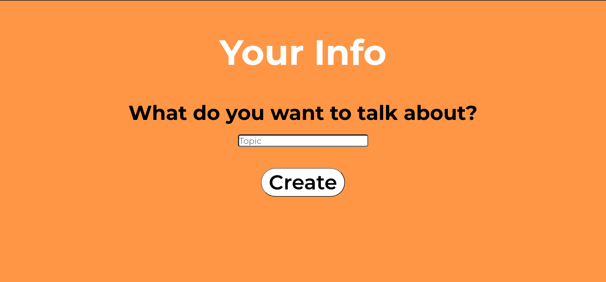
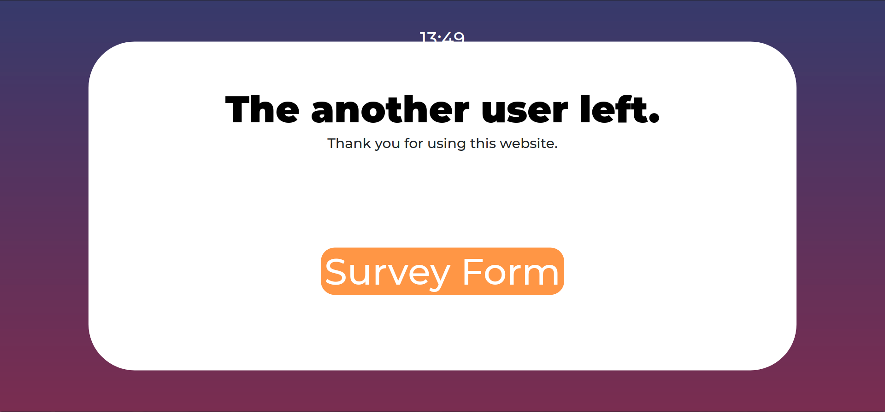

# TalkMatch

<a href="#url" style="font-size: 20px">URL </a>
<a href="#motivation" style="font-size: 20px">Motivation </a>
<a href="#usage" style="font-size: 20px">Usage </a>

> ## URL

https://talk-match.herokuapp.com/

> ## Motivation

One of the problems we have when we learn a second language is that it takes too much money and efforts to register. Also, the online learning is always passive. If we were to experience both the learner and teacher, we will be able to learn more efficiently and faster. This website allows you to find a match in a few seconds and a start conversations. There is no need for registration, this website is self-contained so it's safe.

> ## Usage

### _Start_

You can choose the website either in English or Japanese.

### _Landing Page_

This is the English version of the website.

### _Instruction_

This page explains how to use this website.

### _Choose_

Pick either creating a room or finding a room.

### _Make a room_

Type in the topic you'd like to talk about.

### _Waiting page_

After creating a room, you'll see this waiting page.

### _Finding a room_

Pick one room you'd like to join.

### _When the other user left_

When the other user left the room, this website will pop up.

### _Survey Form_

Please give some advice.

